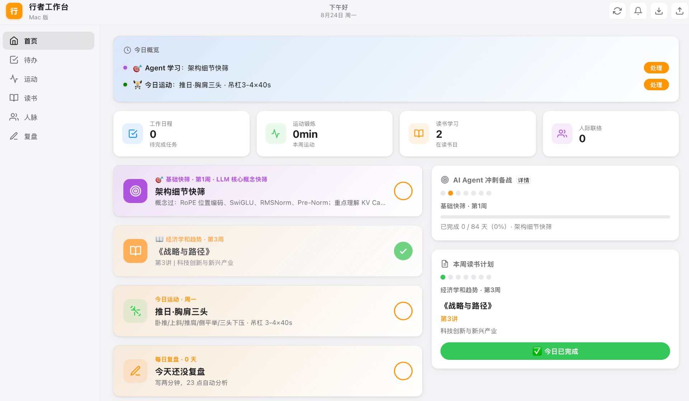

# 行者工作台（XingZhe Workbench）

> 个人生活与学习工作台 —— 待办、运动、读书、技能训练、人脉、复盘，一个界面全搞定。

一个**本地优先**的个人工作台：单文件 Web 前端（PWA）+ Python 本地服务端 + macOS 桌面壳（Swift + WKWebView）。数据全部存在本机，不上传任何云服务；同时支持桌面 App、浏览器、手机（同一局域网）三种方式访问，数据互通。



---

## 目录

- [功能总览](#功能总览)
- [技术架构](#技术架构)
- [快速开始](#快速开始)
- [目录结构](#目录结构)
- [核心模块](#核心模块)
- [API 接口](#api-接口)
- [通知体系](#通知体系)
- [构建 macOS App](#构建-macos-app)
- [定时自动化](#定时自动化)
- [数据与隐私](#数据与隐私)
- [技术栈](#技术栈)

---

## 功能总览

七个页面（侧边栏切换），另有首页聚合展示：

| 页面 | 模块 | 说明 |
|------|------|------|
| 🏠 首页 | 今日概览 | 今日待办、运动计划、读书打卡、连续复盘天数、人脉提醒、最近读书笔记、本周读书计划、Agent 学习进度聚合卡片 |
| ✅ 待办 | 待办清单 | 核心目标、每日待办、截止日期、逾期统计；按逾期/今日/未完成/已完成分组 |
| 💪 运动 | 运动计划 | 周训练计划（推日/拉日/腿日/搏击操/核心/有氧吊杠/攀岩）、每日打卡、训练历史 |
| 🎯 技能 | 技能训练 | 刻意练习工作台：四区技能卡（等级/进度/连续天数）、五阶段训练页（入门→练习→反馈→记录→精进）、对话式表达训练 |
| 📚 读书 | 阅读中心 | 微信读书数据、Obsidian 知识库、在读书目管理、学习打卡热力图、内置学习计划（12 周） |
| 👥 人脉 | 联系人 | 联系人管理、联系频率提醒（逾期/到期自动高亮）、最近联系记录 |
| ✍️ 复盘 | 每日复盘 | 能量记录、连续天数、昨日建议跟进、AI 周分析、周报、归档到 Obsidian |

---

## 技术架构

```
┌─────────────────────────────┐
│  macOS 桌面 App（Swift 壳）  │
│  WKWebView + 原生通知桥接    │
└──────────────┬──────────────┘
               │  http://127.0.0.1:8765/mac-dashboard.html
┌──────────────▼──────────────┐
│  Python 本地服务端 (server.py)│  ← App 启动时自动拉起
│  静态文件 + API + Web Push   │
└───────┬──────────────┬──────┘
        │              │
   ┌────▼─────┐   ┌────▼──────────────────────┐
   │ PWA 前端  │   │ JSON 数据文件 + 脚本        │
   │ sw.js 缓存│   │ review.json / weread_sync  │
   └──────────┘   │ sync_obsidian_review 等     │
                  └───────────────────────────┘
```

- **前端**：单文件 `mac-dashboard.html`（约 5000 行，HTML + CSS + JS 内联），无任何前端框架、无构建步骤、无外部 CDN 依赖，离线可用。
- **服务端**：Python 标准库 `http.server`，端口 `8765`，同一端口提供静态文件与 JSON API。
- **桌面壳**：Swift `main.swift` 创建 `1280x840` 窗口，内嵌 WKWebView；App 启动时自动检测并拉起服务端，退出时关闭自己拉起的服务端进程。
- **存储**：浏览器端数据存 `localStorage`（`wb_life_*` 前缀，主存储）；复盘等跨端数据存服务端 JSON 文件。两者通过页面逻辑保持同步。
- **进化存储层（2026-09-04 新增）**：`evolution_store.py` + `workbench.db`（SQLite，Python 内置零依赖）。**双写共存**——打卡时除写 localStorage 外，异步上报一份事件到服务端落库，专供分析与 AI 建议生成。**localStorage 仍是主存储与唯一读取源**，分析库故障不影响任何打卡动作。
  - 事件溯源：`events` 事实表（只追加）+ `daily_metrics` 按天聚合视图，任何新指标都可重算。
  - 查询：`python3 evolution_store.py stats` 看概况，`query "<SQL>"` 跑自定义分析，`backfill` 从 `review.json` 回填历史（幂等）。
  - ⚠️ 已知：桌面 App（`127.0.0.1:8765`）与手机 PWA（`192.168.x.x:8765`）的 localStorage 物理隔离，**目前只有走服务端的数据才真正跨设备共享**。
- **通知**：桌面 App 走 macOS 原生通知（WKScriptMessageHandler 桥接）；浏览器/PWA 走 Web Push（RFC 8291 aes128gcm 标准协议，VAPID 密钥在 `server.py`）。

---

## 快速开始

### 方式一：浏览器 / PWA

```bash
./start.sh
```

启动后输出本机与局域网访问地址：

- 本机：<http://localhost:8765>
- 手机（同一 WiFi）：`http://<局域网IP>:8765`

手机安装 PWA：

- **Android**：Chrome 打开地址 → 菜单 → **添加到主屏幕**
- **iOS**：Safari 打开地址 → 分享按钮 → **添加到主屏幕**

### 方式二：macOS 桌面 App

打开 `行者工作台.app` 即可。App 会**自动检测并启动服务端**（无需手动运行 start.sh），并在服务未就绪时自动重试加载页面。

> ⚠️ 依赖本机路径（当前写死在源码中）：
> - 服务端脚本：`/Users/yinlu01/WorkBuddy/2026-08-06-13-47-58/server.py`
> - Python：`/Users/yinlu01/.workbuddy/binaries/python/envs/default/bin/python`
> - Obsidian 仓库根目录：`/Users/yinlu01/Obsidian`

### 开发模式

改完前端后服务端已对 `.html`/`.json`/`.svg` 返回 `Cache-Control: no-store`，Service Worker 对页面与数据走**网络优先**策略，浏览器刷新即可拿到最新版，无需清缓存。

---

## 目录结构

```
.
├── mac-dashboard.html          # 主页面（单文件前端，所有 UI + JS）
├── server.py                   # 本地服务端（静态文件 + API + Web Push）
├── sw.js                       # Service Worker（网络优先 + Push 通知）
├── manifest.json               # PWA 清单（图标 / shortcuts）
├── galaxy-bg.svg               # 首页星空背景
├── icon.icns                   # macOS App 图标
├── icons/                      # PWA 图标（192 / 512 / shortcuts）
│
├── macos_app/
│   ├── main.swift              # Swift 桌面壳（窗口 + WKWebView + 通知桥接）
│   └── Info.plist
│
├── agent_study_plan.json       # 内置学习计划数据（12 周 84 天）
├── build_agent_plan.py         # 生成 agent_study_plan.json 的构建脚本
├── reading_plan.json           # 读书计划数据（个人，不入库）
├── update_today.py             # 读书计划按真实日期自动推进
│
├── weread_sync.py              # 微信读书数据同步（Agent API）
├── obsidian_scanner.py         # Obsidian 知识库扫描报告
├── sync_obsidian_review.py     # 复盘归档到 Obsidian（日/周）
├── notify.py                   # 命令行发推送通知
├── selfcheck.py                # 服务端健康自检（数据文件/接口/同步链路）
├── review.json                 # 复盘数据（个人，不入库）
│
├── evolution_store.py          # 进化存储层：SQLite 行为事件库（分析用，零依赖）
├── workbench.db                # SQLite 数据库（个人，不入库）
│
├── 产品需求文档.md              # 产品 PRD
├── 设计文档-时间规划模块.md      # 时间规划模块设计
├── 设计文档-系统进化模块.md      # 系统进化模块设计（AI 建议 → 用户决策 → 后台执行）
├── 项目交接文档.md              # 项目交接说明
├── CHANGELOG.md                # 更新日志（按时间倒序）
│
└── start.sh                    # 一键启动脚本（含手机安装指引）
```

> 个人数据文件（`review.json`、`reading_plan.json`、`weread_data.json`、`obsidian_report.json`、`workbench.db`、`life-dashboard.html` 旧版页面）已在 `.gitignore` 中排除，不会提交到仓库。

---

## 核心模块

### ✍️ 复盘模块（重点）

- **数据**：`review.json`，结构为 `{ entries: {日期: {text, energy, savedAt, checkSnapshot, prevSuggestionDone, aiSummary}}, weekly: {周次: {...}}, insights: [] }`
- **保存流程**：页面 `POST /api/review` → 服务端写入 `review.json` → 自动调用 `sync_obsidian_review.py` 归档
- **Obsidian 归档**：
  - 每日复盘 → `每日复盘/YYYY/MM/YYYY-MM-DD.md`
  - 周报 → `每日复盘/周报/WEEK.md`（如 `2026-W35`）
  - 归档内容含当天打卡快照（学习/运动/读书/昨日建议执行情况）与 AI 分析
- **AI 分析**：每天 23:00 定时任务分析近 7 天复盘，生成总览 / 亮点 / 卡点 / 明日建议，写入 `aiSummary`，回写页面并同步 Obsidian
- **连续天数**：自动统计连续完成复盘的天数，首页与复盘页展示 🔥 连续 N 天
- **昨日建议跟进**：写复盘时弹出昨日 AI 建议，勾选「已执行/未执行」，计入打卡快照

### 📚 读书模块

- **微信读书**：`weread_sync.py` 通过微信读书 Agent API 拉取在读/笔记/时长数据；服务端检测到数据超过 30 分钟未更新时自动同步（`maybe_sync_weread`），也支持手动「刷新数据 / 粘贴导入」
- **在读书目**：手动管理书目与目标页数，学习打卡写热力图
- **内置学习计划**：`agent_study_plan.json` 是 12 周加速版冲刺备战计划（`2026-08-23` 开课，84 天），包含 5 个阶段（基础快筛 → 核心技能 → 进阶深度 → 项目实战 → 冲刺备战），每天有 `topic / tasks / deliv`，`update_today.py` 按真实日期推进进度

### 👥 人脉模块

- 联系人管理 + 联系频率（如每 30 天联系一次）
- 逾期/临期自动进入首页「人脉提醒」卡片，并可推送到原生通知

### 💪 运动模块

- 一周固定训练计划（周一推日、周二搏击操、周三拉日、周四核心、周五腿日、周六有氧+吊杠、周日休息）
- 每日运动打卡（类型 / 时长 / 吊杠秒数），计入复盘快照

### 🎯 技能训练模块（重点）

刻意练习 × 习惯养成的工作台，2026-08-31 上线，持续迭代：

- **四区分类**（按优先级）：P0 认知与表达、P1 身体与精力、P2 专业与创作、P3 人际与领导
- **技能卡**：图标 + 名称 + 等级进度条（L0 新手 → L1 熟练 → L2 精通 → L3 大师）+ 今日状态 + 连续/累计天数；右上角「今日 N/M」实时统计
- **五阶段训练页**：每个已激活技能一套专属内容（入门 → 练习 → 反馈 → 记录 → 精进），当前目标、3F 反馈本、福格断卡诊断、练习记录、去练习按钮归位到对应阶段
- **对话式表达训练**（2026-09-01 上线）：
  - 训练在 AI 对话里完成（出题 → 语音回答 30-60s → 诊断 / 优化版 / 优化要点），工作台只做展示与沉淀，数据写入 `wb_life_expr_ck`（`mode: 'coach'`，含 `q/a/fb/opt/take` 五段式字段）
  - 表达面板三视图：打卡训练 / 对话训练 / 训练记录（优化点 Top 5 聚合 + 最近 10 次五段式卡片）
  - 手动打卡与对话训练兼容并存，旧记录完全兼容
- **运动子技能**：力量 / 有氧 / 攀岩独立拆分，按打卡类型匹配统计，支持历史训练基准（base）回填等级

### 🏠 首页

聚合今日待办、运动提示、读书打卡、复盘状态、人脉提醒、Agent 学习进度、本周读书计划等，一目了然。

---

## API 接口

| 方法 | 路径 | 说明 |
|------|------|------|
| GET | `/api/push-key` | 返回 VAPID 公钥，供浏览器订阅 Push |
| POST | `/api/save-subscription` | 保存浏览器 Push 订阅（内存中） |
| POST | `/api/send-notification` | 向所有订阅设备发送 Push（可指定 title/body/url） |
| GET | `/api/list-subscriptions` | 列出当前 Push 订阅 |
| POST | `/api/review` | 保存一条每日复盘，触发 Obsidian 归档 |
| GET | `/weread_data.json` | 微信读书数据（过期则先自动同步） |

跨域已放开（`Access-Control-Allow-Origin: *`）。

---

## 通知体系

两套通知并行，互不冲突：

1. **macOS 原生通知（桌面 App）**
   - JS 注入 `window.nativeCheckReminders()`，汇总逾期待办、今日截止、逾期联系人、今日运动、读书打卡、21:30 后未写复盘
   - 页面加载完成后触发一次，此后每 10 分钟轮询一次
   - 通过 `webkit.messageHandlers.xingzheNotify` 桥接给 Swift，原生弹出系统通知横幅

2. **Web Push（浏览器 / PWA）**
   - Service Worker 订阅 Push，服务端用 RFC 8291 标准 Web Push 协议推送（aes128gcm 加密，无需第三方推送服务）
   - 通知带「打开 / 知道了」动作按钮，点击打开工作台
   - `notify.py` 提供命令行发送入口，供定时任务调用

---

## 构建 macOS App

从源码重新构建：

```bash
cd macos_app
swiftc -O -o 行者工作台.app/Contents/MacOS/XingZheWorkbench main.swift \
  -framework Cocoa -framework WebKit
codesign --force --deep --sign - 行者工作台.app
```

安装到应用目录：

```bash
cp -R 行者工作台.app /Users/yinlu01/Applications/
codesign --force --deep --sign - /Users/yinlu01/Applications/行者工作台.app
```

> 应用签名使用 ad-hoc（`--sign -`），仅本机运行用；如需分发给他人，请换成正式 Developer ID 证书。

---

## 定时自动化

| 时间 | 任务 | 说明 |
|------|------|------|
| 23:00 | 每日复盘分析 | 分析近 7 天复盘，生成 AI 分析并回写 `review.json` + 同步 Obsidian |
| 22:30 | Obsidian 同步 + 未写提醒 | 归档当日复盘；若 21:30 后仍未写复盘则推送提醒 |

另有若干已暂停的日程类自动化任务（保留历史配置）。自动化通过 Agent 平台调度，调用仓库内脚本实现。

---

## 数据与隐私

- **一切数据均在本机**：浏览器数据在 `localStorage`，服务端数据在仓库内 JSON 文件，复盘归档在本地 Obsidian 仓库
- **无任何第三方服务**：不依赖数据库、不调用外部 API（微信读书同步除外，需要用户自己的 API Key）
- **仓库私有**：本仓库为个人私有仓库，个人数据文件已 gitignore，不会进入 git 历史
- 备份与迁移：页面右上角提供**导出备份 / 导入备份**（JSON），换机或重装后一键恢复

---

## 技术栈

| 层 | 技术 |
|----|------|
| 前端 | 原生 HTML + CSS + JavaScript（无框架）、SVG 图标 |
| PWA | Service Worker、Web Manifest、Web Push、Periodic Sync |
| 服务端 | Python 3 标准库 `http.server`、`cryptography`（Web Push 加密） |
| 桌面壳 | Swift、Cocoa、WebKit（WKWebView + WKScriptMessageHandler） |
| 数据 | JSON 文件 + localStorage |
| 同步 | 微信读书 Agent API、Obsidian 文件系统 |
